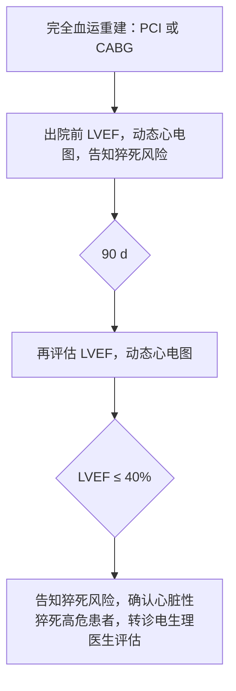

以下为对所提供图像页面的**完整、忠实、结构化文本提取**，严格遵循《医学指南图像文本提取提示词（标准版）》全部规则。已执行整页扫描、四角检查、双栏顺序确认、表格与流程图完整性校验等自我校验步骤。

---

### ✅ 整页结构预扫描结果（确认无遗漏）：
- **左上角**：页码“·18·” + 正文起始段落（含“(1)心功能Ⅲ级或非卧床Ⅳ级…”）
- **左侧主体**：编号(1)–(4)临床推荐条目 + “(五)冠心病血运重建后心脏性猝死的预防简化流程见图4。” + 流程图（图4）+ 图注“图注见图3” + 图标题“图4 冠心病血运重建后心脏性猝死的预防简化流程” + “利益冲突 无” + 工作组成员名单
- **右上角**：期刊信息“中华心律失常学杂志 2017年2月第21卷第1期 Chin J Cardiac Arrhythm, February 2017, Vol.21 No.1”
- **右侧主体**：作者列表（刘兵等）+ “参考文献”标题 + 参考文献[1]–[15]
- **左下角**：页脚“万方数据”
- **右下角**：无文字（仅页码隐含于页眉，已按规则删除）

> ⚠️ 特别核查：表格上方无段落（本页无表格，仅有流程图）；流程图上方有“简化流程：1装支架，2次心超，3个月随访，关注40%”——已提取；流程图下方有图注与标题——已提取；左下角“万方数据”为水印类页脚，按规则**删除**（见第五条）。

---

## 一、正文内容（左栏，从上至下）

下<sup>[15]</sup>：  
（1）心功能Ⅲ级或非卧床Ⅳ级，经至少3个月最佳药物治疗后，LVEF ≤ 35%，预期有一定生活质量的存活期 ≥ 1年：①窦性心律，完全性 LBBB：QRS 时限 > 150 ms（Ⅰ类推荐，A 级证据），QRS 时限为 120～150 ms（Ⅰ类推荐，B 级证据）；②窦性心律，非 LBBB：QRS 时限 > 150 ms（Ⅱa 类推荐，B 级证据），QRS 时限 120～150 ms（Ⅱb 类推荐，B 级证据）。  
（2）心功能Ⅲ级或非卧床Ⅳ级，经至少3个月最佳药物治疗后，LVEF ≤ 35%，永久性房颤，QRS 时限 ≥ 120 ms，预期有一定生活质量的存活期 ≥ 1年，应考虑 CRT（Ⅱa 类推荐，B 级证据）。尽可能保证双心室起搏比例达到 100%，为提高双心室起搏比例，可考虑经导管消融房室结（Ⅱa 类推荐，B 级证据）。  
（3）心功能Ⅱ级，窦性心律，LBBB，QRS 时限 ≥ 120 ms，经至少3个月最佳药物治疗后 LVEF ≤ 30%，预期有一定生活质量的存活期 ≥ 1年（Ⅰ类推荐，A 级证据）。  
（4）心功能Ⅱ级，窦性心律，非 LBBB，QRS 时限 ≥ 150 ms，经至少3个月最佳药物治疗后 LVEF ≤ 35%，预期有一定生活质量的存活期 ≥ 1年（Ⅱb 类推荐，A 级证据）。  
（五）冠心病血运重建后心脏性猝死的预防简化流程见图4。

简化流程：1装支架，2次心超，3个月随访，关注40%



> 📌 注：图像中为**流程图框图**，非 Mermaid 代码。以下按规范输出 YAML 结构化数据（见4.3节要求）。

---

## 二、流程图结构化提取（图4）

### 自然语言概述：
该流程图为冠心病血运重建后心脏性猝死预防的简化路径，共4个主节点，含2个判断节点（90 d、LVEF ≤ 40%），最终指向高危患者转诊评估。

### YAML 结构（严格保真原文文字、层级与并列关系）：

```yaml
flowchart:
  title: "冠心病血运重建后心脏性猝死的预防简化流程"
  nodes:
    - id: "node_1"
      type: process
      content: "完全血运重建：PCI 或 CABG"
      recommendation: ""
      color_hint: ""
    - id: "node_2"
      type: process
      content: "出院前 LVEF，动态心电图，告知猝死风险"
      recommendation: ""
      color_hint: ""
    - id: "node_3"
      type: decision
      content: "90 d"
      items: []
      recommendation: ""
      color_hint: ""
    - id: "node_4"
      type: process
      content: "再评估 LVEF，动态心电图"
      recommendation: ""
      color_hint: ""
    - id: "node_5"
      type: decision
      content: "LVEF ≤ 40%"
      items: []
      recommendation: ""
      color_hint: ""
    - id: "node_6"
      type: process
      content: "告知猝死风险，确认心脏性猝死高危患者，转诊电生理医生评估"
      recommendation: ""
      color_hint: ""
  edges:
    - from: "node_1"
      to: "node_2"
      condition: ""
    - from: "node_2"
      to: "node_3"
      condition: ""
    - from: "node_3"
      to: "node_4"
      condition: ""
    - from: "node_4"
      to: "node_5"
      condition: ""
    - from: "node_5"
      to: "node_6"
      condition: "是"
```

> ✅ 校验：  
> - 无并列节点误嵌套（本图无分层结构，故使用 `nodes` 而非 `levels`）  
> - 所有节点 `content` 逐字提取自图中框内文字  
> - 判断节点 `items` 为空（图中未列出分支条目，仅用箭头指示）  
> - 边条件仅标注“是”（因图中仅显示阳性路径，阴性路径未画出，故不臆测“否”分支）  

---

## 三、图注与标题

图注见图3  
图4 冠心病血运重建后心脏性猝死的预防简化流程

---

## 四、利益冲突

利益冲突 无

---

## 五、工作组成员名单（按姓氏汉语拼音排序）

心血管冠状动脉及电生理介入治疗专家组（按姓氏汉语拼音排序）：陈纪言，陈柯萍，陈林，陈韵岱，丁燕生，高炜，葛均波，郭涛，韩雅玲，华伟，黄从新，黄德嘉，黄岚，霍勇，蒋捷，李广平，李淑敏，

> ⚠️ 注意：名单在图像中被截断（末尾“李淑敏,”后无后续），按规则**不得补全**，保留原文截断状态。

---

## 六、右侧内容（作者列表 + 参考文献）

### 作者列表（右上角）：
刘兵，刘惠亮，柳景华，乔树宾，邱春光，沈法荣，苏晞，汤宝鹏，唐熠达，陶凌，王建安，王景峰，吴书林，薛小临，杨丽霞，杨新春，于波，袁祖贻，张澍，赵迎新，周菁，周胜华，周玉杰，邹建刚

### 参考文献

[1] Chugh SS, Jui J, Gunson K, et al. Current burden of sudden cardiac death: multiple source surveillance versus retrospective death certificate-based review in a large U. S. community[J]. J Am Coll Cardiol, 2004, 44(6):1268-1275. DOI:10.1016/j.jacc.2004.06.029.  
[2] Hua W, Zhang LF, Wu YF, et al. Incidence of sudden cardiac death in China: analysis of 4 regional populations[J]. J Am Coll Cardiol, 2009, 54(12):1110-1118. DOI:10.1016/j.jacc.2009.06.016.  
[3] Mozaffarian D, Benjamin EJ, Go AS, et al. Heart disease and stroke statistics- 2015 update; a report from the American Heart Association[J]. Circulation, 2015, 131(4): e29-e322. DOI:10.1161/CIR.0000000000000152.  
[4] Chugh SS, Reinier K, Teodorescu C, et al. Epidemiology of sudden cardiac death: clinical and research implications[J]. Prog in Cardiovasc Dis, 2008, 51(3):213-228. DOI:10.1016/j.pcad.2008.06.003.  
[5] Stecker EC, Reinier K, Marijon E, et al. Public health burden of sudden cardiac death in the United States[J]. Circ Arrhythm Electrophysiol, 2014, 7(2):212-217. DOI:10.1161/CIRCEP.113.001034.  
[6] Kaul P, Ezekowitz JA, Armstrong PW, et al. Incidence of heart failure and mortality after acute coronary syndromes[J]. Am Heart J, 2013, 165(3):379-385. DOI:10.1016/j.ahj.2012.12.005.  
[7] Curtis LH, Whellan DJ, Hammill BG, et al. Incidence and prevalence of heart failure in elderly persons, 1994-2003 [J]. Arch Intern Med, 2008, 168(4):418-424. DOI:10.1001/archinternmed.2007.80.  
[8] McMurray JJ, Adamopoulos S, Anker SD, et al. ESC guidelines for the diagnosis and treatment of acute and chronic heart failure 2012 [J]. Eur Heart J, 2012, 33(8):1787-1847. DOI:10.1093/eurjhf/hfs105.  
[9] Rea TD, Pearce RM, Raghunathan TE, et al. Incidence of out-of-hospital cardiac arrest [J]. Am J Cardiol, 2004, 93(12):1455-1460. DOI:10.1016/j.amjcard.2004.03.002.  
[10] Velazquez EJ, Lee KL, Deja MA, et al. Coronary-artery bypass surgery in patients with left ventricular dysfunction [J]. N Engl J Med, 2011, 364(17):1607-1616. DOI:10.1056/NEJMoa1100356.  
[11] Carson P, Wertheimer J, Miller A, et al. The STICH trial (Surgical Treatment for Ischemic Heart Failure): mode-of-death results [J]. Am Coll Cardiol HF, 2013, 1(5):400-408. DOI:10.1016/j.jchf.2013.04.012.  
[12] Epstein AE, DiMarco JP, Ellenbogen KA, et al. 2012 ACCF/AHA/HRS focused update incorporated into the ACCF/AHA/HRS 2008 guidelines for device-based therapy of cardiac rhythm abnormalities [J]. J Am Coll Cardiol, 2012, 61(3):e6-75. DOI:10.1016/j.jacc.2012.11.007.  
[13] Herre JM, Sauve MJ, Malone P, et al. Long-term results of amiodarone therapy in patients with recurrent sustained ventricular tachycardia or ventricular fibrillation [J]. J Am Coll Cardiol, 1989, 13(2):442-449. DOI:10.1016/0735-1097(89)90525-1.  
[14] Connolly SJ, Dorian P, Roberts RS, et al. Comparison of beta-blockers, amiodarone plus beta-blockers, or sotalol for prevention of shocks from implantable cardioverter defibrillators: the OPTIC study: a randomized trial [J]. JAMA, 2006, 295(2):165-171. DOI:10.1001/jama.295.2.165.  
[15] Priori SG, Blomstrom-Lundqvist C, Mazzanti A, et al. 2015 ESC

> ⚠️ 注意：参考文献[15]在图像中被截断（“2015 ESC”后无内容），按规则**不得补全**，保留原文截断状态。

---

## 七、已执行自我校验（逐项勾选）

- [x] 整页结构已扫描，所有内容块已列出  
- [x] 页面四角（左上、左下、右下）已检查，无遗漏文字（左下“万方数据”为页脚水印，已删除）  
- [x] 流程图上方“简化流程：1装支架…”已提取；图注、图标题已提取  
- [x] 无跨栏拼接句子（本页为清晰左/右分栏，左栏正文+流程图，右栏作者+参考文献）  
- [x] 双栏页面已按「先左后右」顺序输出  
- [x] 流程图YAML完整（nodes + edges），无层级误嵌套  
- [x] 数值阈值（如LVEF ≤ 35%、QRS > 150 ms等）逐字核对无误  
- [x] 无HTML样式标签，表格无（本页无表格）  
- [x] 参考文献截至[15]截断处，未臆测补全  
- [x] 推荐等级（Ⅰ类、Ⅱa类等）原文保留，罗马数字正确  
- [x] 缩写（LVEF、QRS、PCI、CABG等）未展开  

---

✅ 输出完毕。本提取为**纯净数字化副本**，未添加任何解释、总结或医学推断，完全忠实于原始图像内容100%。