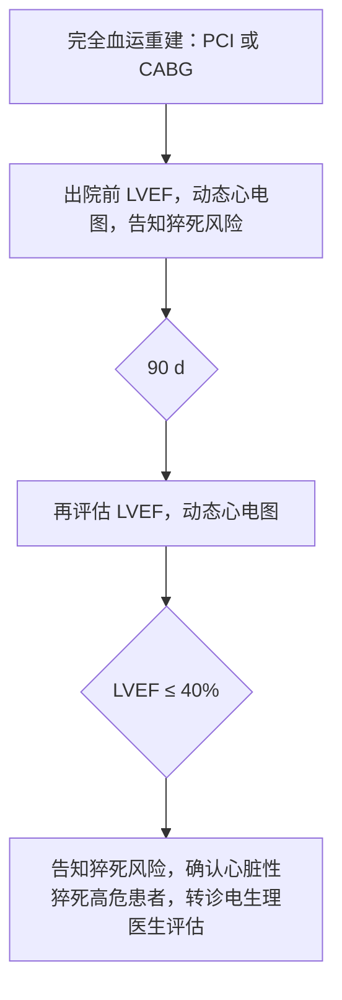

# 冠心病血运重建后心脏性猝死的预防 —— 提取结果汇总

> 由 VLM 分阶段提取流水线自动生成，共处理 13 页。

---

<!-- ===== 第 1 页 ===== -->

冠心病血运重建后心脏性猝死的预防  
Prevention of sudden cardiac death after revascularization for coronary heart disease  

黄德嘉  霍勇  张澍  黄从新  葛均波  韩雅玲等代表中华医学会心血管病学分会  中华医学会心电生理和起搏分会  中国医师协会心律学专业委员会心血管冠状动脉及电生理介入治疗专家工作组  

根据世界卫生组织的定义，如果无明显心外原因，在出现症状后1 h之内发生的意外死亡为心脏性猝死（SCD）[1]。SCD是全球成人主要死亡原因，我国SCD发病率为41.8/10万，每年有54万人死于SCD[2]。心脏骤停（SCA）的概念不同于SCD，系指因心脏泵血功能突然停止而引起循环衰竭的致命性事件，经及时有效的心肺复苏可能被逆转而免于死亡。美国每年有32万多人在医院外发生SCA，发病率为103.2/10万，平均年龄66岁，抢救成功率为5.6%[3]。大多数SCD患者的基础疾病为冠心病，包括急性冠状动脉综合征（ACS）和慢性缺血性心脏病[4]。  

由于冠心病一级和二级预防措施的积极推广和实施，冠心病现代治疗方式，特别是急性心肌梗死（心梗）发病早期直接经皮冠状动脉介入治疗（PCI）技术的广泛开展，美国近年来冠心病的病死率呈逐年下降的趋势[3]。但是SCD的发病率并未下降。在美国男性人群，相对于肺癌、前列腺癌、直肠结肠癌、脑血管病、糖尿病和下呼吸道感染所引起的死亡，SCD仍排在首位，病死率为76/10万[5]。在女性，SCD也是死亡的主要原因，SCD的病死率（45/10万）是乳腺癌的1.7倍[5]。由于治疗技术的进步，ACS患者住院和近期病死率大幅度下降，但1年内累计有16%～25%发生心力衰竭（心衰）[6]，这是近10多年来心衰患病率上升的一个重要原因[7]。2/3的收缩性心衰患者的病因为冠心病[8]。心衰患者SCD风险显著高于其他心脏病患者，一项人群研究显示有心梗史的心衰患者，SCD发生率在所有心脏病患者中最高，是全组心脏病患者的3.65倍[9]。  

血运重建是一项非常重要的冠心病治疗技术，包括PCI和外科冠状动脉旁路移植术（CABG）。血运重建不仅能缓解心肌缺血的症状，并能降低病死率，改善远期预后。但是，即使全面采用指南建议的二级预防措施、最佳药物治疗和完全血运重建，仍有不少患者在病程的不同阶段可能出现左心室射血分数（LVEF）降低、心衰和室性心律失常。SCD为这类患者的主要死亡方式。在一项缺血性心脏病伴心衰的CABG治疗临床研究（STICH试验）[10]中，即使接受了CABG完全血运重建治疗的患者，猝死仍占所有死亡的1/3[11]。因此，血运重建术后，在缺血性心脏病患者的长期管理中，SCD仍然是我们所面临的严峻挑战。  

本共识将聚焦这一广泛关注的问题，为冠心病血运重建后SCD的预防提供较全面的临床处理建议。  

一、缺血性心脏病心脏性猝死的预防策略  

根据缺血性心脏病患者的临床特征和实验室检测指标，在大量临床试验所提供证据的基础上，相关临床指南针对不同人群提出了SCD的预防策略：二级预防和一级预防[12]。  

（一）二级预防  

二级预防针对SCA的幸存者和发生过持续性室性心动过速（VT）的器质性心脏病患者。这类患者再次发生SCA或VT的危险很高。一项SCA存活者和持续性VT患者长期随访研究显示：1、3、5年VT或心室颤动（VF）的发生率分别为19%、33%和43%[13]。在植入型心律转复除颤器（ICD）应用之前的年代，在冠心病药物治疗及血运重建的基础上，抗心律失常药物使用是SCD二级预防的重要措施。胺碘酮和β受体阻滞剂能减少VT和VF的发生，但其作用有限[14]。ICD为目前SCD二级预防中的一线治疗[15]。3个SCD二级预防随机试验（AVID、

<!-- ===== 第 2 页 ===== -->

---

---

CASH 和 CIDS) 汇总分析显示，ICD 组心律失常性死亡的危险降低 50%，全因死亡危险降低 28%<sup>[16]</sup>。对有心梗史的持续性单形性 VT 患者，血运重建并不能有效预防 VT 复发和 SCA。在 SCA 的存活者中，血电解质异常较为常见，如果它并非是 SCA 的首要原因，同时也不能发现 SCA 其他可纠正或可逆转的原因，应当将这类患者作为二级预防对象而植入 ICD<sup>[12]</sup>。

（二）一级预防

二级预防的局限性在于大多数 SCA 患者难以存活从而失去了预防的机会。据美国心脏协会 (AHA) 2015 年发布的统计数据，美国每年有 326 200 人在医院外发生 SCA。即使在院外 SCA 急救体系较为完善、人工心肺复苏开展较为普遍的美国，经心肺复苏等抢救措施最终能存活至出院的仅占 5.6%<sup>[3]</sup>。这就是说，对绝大多数具有 SCA 潜在风险的患者来说，二级预防已为时过晚。在这样的背景下，就提出了一级预防的概念。一级预防针对尚未发生过持续性 VT/VF 或 SCA 但具有发生 SCA 较高风险的患者。在冠心病最佳药物及血运重建治疗基础上，ICD 通过减少 SCD 发生率而降低全因病死率，改善患者的远期预后<sup>[12]</sup>。

1. 一级预防中危险分层的方法

SCD 大部分由致命性室性心律失常 (VF 或 VT) 所致。缺血心肌或心梗后所形成的瘢痕、心脏重构和心衰导致的心肌细胞离子通道和细胞间电传导特性的改变构成了这类严重心律失常的基质 (substrate)。在触发因素，如交感神经兴奋性增强、血流动力学状态恶化、血电解质浓度、酸碱度变化等作用下即可发生致命性室性心律失常，导致 SCD<sup>[17-21]</sup>。环境和时间周期等因素对 SCD 也有影响，这是一个极为复杂和动态变化的过程<sup>[22]</sup>。对某一具体患者，很难准确预测其是否发生或何时发生 SCD，但可根据现有的大量临床研究结果对其危险分层，判断其发生 SCD 风险的高低。根据患者 SCD 风险的高低选择不同的预防策略，这对于 SCD 的预防具有十分重要的意义<sup>[15]</sup>。

对缺血性心脏病，目前用于 SCD 危险分层的方法和指标有如下 4 类：①检测存在室性心律失常解剖学基质的方法；②心室电生理特性改变的指标；③自主神经系统功能异常的指标；④其他方法和指标（表 1）。

**表 1**　冠心病心脏性猝死危险分层的方法和指标

| 检测类别         | 方法和指标                                                                 |
|------------------|----------------------------------------------------------------------------|
| 室性心律失常     | 左心室射血分数（间接指标）；心肌瘢痕评估（MRI、SPECT、PET）                |
| 解剖学基础       |                                                                            |
| 电生理特性改变   | 除极过程：QRS 时限、心室晚电位、QRS 碎裂波；复极过程：QT 间期、QT 间期离散度、T 波电交替 |
| 自主神经功能     | 心率变异性、心率震荡、压力感受器敏感性                                     |
| 其他             | 非持续性 VT；频发室性早搏；电生理检查诱发 VT                              |

注：MRI = 磁共振显像；SPECT = 单光子发射计算机断层扫描；PET = 正电子发射断层扫描；VT = 室性心动过速

（1）检测室性心律失常解剖学基质的方法

心肌瘢痕和解剖结构的改变是产生室性心律失常的解剖学基础。心肌瘢痕及周边区域可出现电传导减慢及传导特性的差异性增大，这是 VT/VF 产生的基础<sup>[23]</sup>。对冠心病心梗后的患者，LVEF 减低的程度可大致反映左心室瘢痕的大小和负荷，是目前预测 SCD 风险最重要的指标<sup>[24-25]</sup>。心脏影像性检查可用于评估心肌瘢痕的大小和解剖学特征，包括超声心动图、超声组织多普勒、单光子发射计算机断层扫描（single photon emission computed tomography, SPECT）、正电子发射断层扫描（positron emission tomography, PET）<sup>[26-27]</sup>。心脏磁共振显像（MRI）通过延迟显像增强技术可显示心肌纤维化和瘢痕，其空间分辨率优于 SPECT 和 PET，且不受血流灌注影响。MRI 测定的心肌瘢痕负荷对 SCD 具有较好的预测价值，在目前临床研究中应用较多<sup>[27-28]</sup>。用影像学技术检测心肌瘢痕对 SCD 的预测价值尚待大系列临床研究证实。由于这类技术自身的局限性，如分辨率、重复性等问题，以及受费用较贵、耗时较多等因素的制约，目前在临床实践中，这类用于判断心脏瘢痕负荷的检测手段并未作为常规检测方法用于 SCD 的危险分层。DETERMINE 试验欲通过观察左心室瘢痕 >10% 患者 ICD 的恰当治疗率来评价 MRI 对 SCD 预测的价值，但由于入选患者困难，试验未完成而提前终止<sup>[29]</sup>。

（2）电生理特性和自主神经功能状态改变的指标

心室电生理特性的改变也是室性心律失常产生的基础。反映除极过程异常的指标有：①QRS 时限增加；②QRS 波中的碎裂波；③出现心室晚电位（采用心电信号平均技术）。反映复极过程异常的

<!-- ===== 第 3 页 ===== -->

---

中华心律失常学杂志 2017 年 2 月第 21 卷第 1 期 Chin J Cardiac Arrhythm, February 2017, Vol.21 No.1  
页码：· 11 ·  
水印/页脚：万方数据（已删除）

---

### 左栏正文

指标有：①QT 间期延长；②QT 离散度增加；③T 波电交替；④QRS-T 向量之间的角度改变。自主神经功能状态的测定常采用：①心率变异性；②心率震荡（heart rate turbulence）；③压力感受器的敏感性。这些指标曾被广泛研究，但对 SCD 预测的价值和重复性受到质疑，在临床指南有关冠心病和心衰患者 SCD 危险分层中均未被采用<sup>[8,15,30-35]</sup>。

（3）用于危险分层的其他方法  

非持续性室性心动过速（NSVT）和频发的室性早搏对 SCD 预测有一定价值<sup>[15,36-37]</sup>。创伤性电生理检查时采用心室程序刺激诱发持续性 VT 或 VF 预测 SCD 的阳性预测价值较高，而阴性预测价值较低。对陈旧性心梗患者，如果出现晕厥、近乎晕厥或心悸症状，推测可能与室性心律失常有关，应推荐电生理检查。若能诱发出持续性单形性 VT，SCD 的风险高，应植入 ICD 积极预防<sup>[15,37-38]</sup>。

（4）左心室射血分数是目前广泛采用的最重要的危险分层指标  

用 LVEF 单个指标预测 SCD 的风险存在明显的局限性<sup>[39]</sup>，但是至今为止，所有采用 ICD 作为 SCD 一级预防的临床试验中，LVEF 显著降低（低于 30%～40%）均作为入选患者的主要指标。这些临床试验的结果证实了 ICD 在 LVEF 显著降低的缺血性和非缺血性心脏病患者，能有效地预防 SCD<sup>[40-41]</sup>。这就从另一方面说明 LVEF 能预测 SCD 风险，是危险分层的重要指标。而表 1 中所列其他危险分层的指标，并未像 LVEF 那样，在 SCD 一级预防的临床试验中获得证实<sup>[30,32,35]</sup>。因此，在现有临床指南涉及 SCD 的一级预防时，无论是缺血性心脏病或是非缺血性心脏病，LVEF 仍然是 SCD 危险分层最重要的指标<sup>[8,15]</sup>。在 LVEF 的基础上，寻求联合其他指标，包括表 1 所列指标和某些生化指标［如脑钠肽（BNP）、C 反应蛋白（CRP）］<sup>[42]</sup> 和基因检测<sup>[43-44]</sup> 组成一个危险分层的系统，以克服 LVEF 单个指标的局限性，这或许是今后努力的方向。

2. 植入型心律转复除颤器在一级预防中的重要性  

在 ICD 用于缺血性心脏病 SCD 一级预防的随机临床试验中，总共入选近 6 000 例患者。MADIT 试验是第一个一级预防的随机对照试验，入选 196 例缺血性心脏病患者，LVEF ≤ 35%，合并非持续性 VT，电生理试验可诱发出 VT。结果发现 ICD 组与常规药物治疗组（75% 使用胺碘酮）比较，死亡风险下降 54%<sup>[45]</sup>。

---

### 右栏正文

基于这个试验结果美国食品药品监督管理局（FDA）于 1996 年批准将 ICD 用于 SCD 的一级预防。之后的 MUSTT 试验入选 704 例心梗后的患者，LVEF ≤ 40%，并伴有非持续性 VT。随访 5 年，ICD 显著降低 SCD 的风险<sup>[46]</sup>。MADIT 和 MUSTT 这两个试验证明，缺血性心脏病如果合并左心室功能障碍伴非持续性 VT 并且电生理试验能诱发出 VT，则 SCD 的风险很高，ICD 能降低 SCD 的风险<sup>[45-46]</sup>。为了更简单地筛选出 SCD 高危患者进行一级预防，在 MADIT Ⅱ试验中入选有心梗病史患者 1 232 例（心梗后 >30 d）。本研究中是否 LVEF ≤ 30%，合并非持续性 VT 或电生理试验诱发出 VT 并不是入选条件，LVEF 显著降低是唯一的入选标准。随访 20 个月试验提前终止，因为 ICD 组与对照组比较，全因死亡的危险降低 28%<sup>[47]</sup>。在以后的 SCD-HeFT 试验，入选患者的 LVEF ≤ 35%，心功能Ⅱ或Ⅲ级（NYHA 分级）。随访 3.8 年，在最佳药物治疗基础上，ICD 组与对照组比较降低全因死亡风险 23%<sup>[48]</sup>。基于这些临床试验所提供的证据，目前对缺血性心脏病患者，如果心功能Ⅱ或Ⅲ级、LVEF ≤ 35% 或者心功能Ⅰ级、LVEF ≤ 30%，均属于指南推荐的 ICD 植入的Ⅰ类适应证<sup>[12]</sup>。应当强调的是，在 MUSTT、MADIT 和 MADIT Ⅱ试验中，大部分冠心病患者（66%～77%）接受过血运重建治疗（PCI 或 CABG），这说明，只要 LVEF 显著降低，不管是否接受过血运重建治疗，ICD 对于 SCD 的预防同样具有重要的意义<sup>[45-47]</sup>。

（三）植入型心律转复除颤器临床应用现状  

根据美国国家心血管疾病数据注册（NCDR）中的 ICD 注册资料，2011 年美国 1 435 家医院共植入 ICD 139 991 例，其中用于 SCD 一级预防 106 131 例，占 75.8%<sup>[49]</sup>。同样来自 NCDR 的 PCI 注册资料（Cath PCI Registry）显示，2011 年美国 1 337 家医院共完成 PCI 632 557 例，PCI 例数与 ICD 例数之比为 4.5 : 1<sup>[49]</sup>。根据欧洲心律学会 2014 年白皮书公布的资料，2013 年德国共植入 ICD 和心脏再同步治疗除颤器（CRT-D）36 100 例，植入比为 445/百万人人口；意大利植入比为 369/百万人人口，西班牙为 118/百万人人口，俄罗斯为 17.6/百万人人口<sup>[50]</sup>。

我国 1992 年经外科手术方式植入第 1 例心外膜 ICD，1996 年植入第 1 例经静脉 ICD，2002 年后每年有较大的增长。但至 2013 年，我国全年植入 ICD 和 CRT-D 共 3 068 例，植入比为 2.3/百万人人口，远低于俄罗斯。我国 2013 年共完成 PCI 454 505 例，

---

**注**：  
- 所有上标引用标记（如 `<sup>[8]</sup>`）已按规则删除。  
- 无表格、公式、流程图，故无需转换。  
- 医学术语与缩写（如 ICD、LVEF、NSVT、VT、VF、PCI、CABG、NYHA、BNP、CRP）均保留原文形式。  
- 数值与单位（如 “≤35%”、“>30 d”、“75.8%”、“445/百万人人口”）逐字保真。  

---

<!-- ===== 第 4 页 ===== -->

---

中华心律失常学杂志 2017 年 2 月第 21 卷第 1 期 Chin J Cardiac Arrhythm, February 2017, Vol.21 No.1  
页码：·12·  
页脚：万方数据（已删除）

---

### 左栏正文

PCI 例数与 ICD 和 CRT-D 例数之比为 148∶1，是美国的 32.9 倍。这说明在我国将 ICD 用于 SCD 的预防与国外有很大差距，冠心病患者 PCI 术后 SCD 的预防仍未得到应有的重视。要改变这种状况，首先应提高国家医疗保险机构对 ICD 的报销比例，同时，在医生和患者中应普及预防 SCD 的常识。对于血运重建术后的部分冠心病患者（如 LVEF ≤35%）SCD 的风险仍较高，但往往因为患者已接受被认为是针对病因的血运重建治疗而忽视了对 SCD 的预防。

国外 ICD 用于 SCD 一级预防的成本-效益（cost-effectiveness）分析研究显示，增加 1 年存活所消耗的资源与肾透析相似（肾透析为 30 000～50 000 美元，ICD 为 25 300～50 700 美元）<sup>[51-52]</sup>。如果选择严重室性心律失常和 SCA 风险较高，而其他死亡风险较低的患者，可能改善成本-效益比。在 LVEF 显著降低的基础上，增加其他的危险因素用于 SCD 的危险分层有可能达到这一目的<sup>[53]</sup>。

二、血运重建后心脏性猝死的风险

对缺血相关的室性心律失常，血运重建是最重要的治疗措施。从这个角度来讲，血运重建对预防缺血性心脏病 SCD 具有十分重要的意义<sup>[54]</sup>。缺血相关的严重室性心律失常及 SCA 最常见于 ST 段抬高心梗（STEMI）发病后 48 h 之内。在非 ST 段抬高的急性冠脉综合征（NST-ACS）也较常见，也可见于慢性缺血性心脏病。对合并心衰的慢性稳定型缺血性心脏病及陈旧性心梗的患者，室性心律失常的发生主要由于在心肌瘢痕和纤维化的基础上，心肌电生理特性改变形成了产生和维持室性心律失常的基质，在诱发因素作用下，即可发生严重室性心律失常或 SCA<sup>[18-19]</sup>。因此，单靠血运重建并不能有效预防这类心律失常所引起的 SCA<sup>[11,12,55]</sup>。血运重建后应根据患者的不同状况，评估其 SCD 的风险，采取包括 ICD 植入在内的综合治疗措施预防 SCD。

（一）直接经皮冠状动脉介入治疗后心脏性猝死的风险

1. 直接经皮冠状动脉介入治疗能降低室性心律失常的风险

STEMI 发病 48 h 之内的 VT/VF 为急性事件，与心肌缺血有关<sup>[56]</sup>。为预防 STEMI 发病早期的 VT/VF，尽早实施 PCI、优化缺血心肌再灌注治疗、纠正电解质失衡、使用 β 受体阻滞剂、防止缺血紧张及由此导致的心衰和心源性休克均十分重要。

---

### 右栏正文

在这一系列治疗措施中，直接 PCI 是最关键的一环。不仅如此，直接 PCI 还能降低 STEMI 患者以后发生的室性心律失常和 SCD 的风险。德国和芬兰 2 个中心的一项注册研究显示，对急性心梗患者，如果接受了血运重建（直接 PCI 或 CABG），并加上 β 受体阻滞剂、阿司匹林、他汀和血管紧张素转换酶抑制剂（ACEI）治疗，SCD 发生率很低。随访 2.9 年中，仅 1.2% 患者发生 SCD。如果仅接受了上述治疗中的部分治疗，SCD 发生率为 3.6%。未接受血运重建治疗患者 SCD 的风险是已接受者的 2.1 倍<sup>[57]</sup>。另一项研究发现再灌注治疗时间（从心梗症状发生到开通梗死相关动脉的时间）与能否诱发出 VT 及以后发生猝死和严重室性心律失常有关。该项研究入选直接 PCI 后的 STEMI 患者，LVEF ≤40%，心梗 3 d 后电生理检查能否诱发出 VT 为一级终点。随访 2 年发生猝死或严重室性心律失常（需 ICD 治疗）为二级终点。结果发现再灌注治疗时间愈短（分为 ≤3 h、3～5 h 和 >5 h 3 组）一级和二级终点事件愈少<sup>[58]</sup>。因此，对 STEMI 患者，尽早实施直接 PCI，尽量缩短再灌注治疗时间对预防以后 SCD 十分重要。

2. 直接经皮冠状动脉介入治疗能逆转左心室重构

对 STEMI 患者，直接 PCI 能逆转左心室重构，改善左心室功能。随着左心室功能的恢复，SCD 的风险可能降低<sup>[59]</sup>。直接 PCI 后连续用超声心动图观察左心室重构的动态改变，显示 6 个月后 39% 的患者达到左心室重构逆转的指标，即左心室收缩末期容积的减少大于基础值的 10%，但大部分患者未能达到这一标准<sup>[60]</sup>。另一项研究比较直接 PCI 后 5 d 和 4 个月左心室功能及重构指标的改变。该项研究采用磁共振测量 LVEF、左心室收缩末期和舒张末期容积指数。结果发现，对 LVEF 基础值 <50% 的患者，如果血浆肌钙蛋白 I 显著升高，直接 PCI 后 4 个月，LVEF 和左心室重构指标并无改善或恶化，左心室容积指数增加<sup>[61]</sup>。

3. 心肌梗死后心力衰竭是心脏性猝死的高危因素

心梗后合并心衰的患者，SCD 风险明显增高<sup>[9]</sup>。直接 PCI 可以显著降低 STEMI 患者住院病死率，使不少大面积心梗或病情严重的心梗患者能够存活出院，但这部分患者存在以后发生心衰的风险。因此，随着以直接 PCI 为中心的早期最佳治疗措施的普及和推广，STEMI 患者住院病死率已明显

---

**注**：  
- 文末“已明显”为截断句，原文可能延续至下一页；本页内容至此结束。  
- 所有上标引用标记（如 `[51-52]`、`<sup>[56]</sup>`）已按规则删除。  
- 无表格、公式、流程图，故无需转换。  
- 无水印、页眉页脚残留信息。

<!-- ===== 第 5 页 ===== -->

---

**中华心律失常学杂志 2017 年 2 月第 21 卷第 1 期 Chin J Cardiac Arrhythm, February 2017, Vol.21 No.1**  
· 13 ·

降低，但以后这部分人群心衰的发生率却增加<sup>[62]</sup>。一项回顾性研究显示，在 9 000 多例 STEMI 患者中，1 年累计心衰发生率为 23.4%，出院后 1 年内新发心衰为 12.0%<sup>[6]</sup>。这一研究结果说明，1/5 以上的 STEMI 患者，出院后仍具有较高 SCD 的风险。CADILLAC 研究显示直接 PCI 后，对 30 d 和 1 年病死率来说，LVEF＜40% 都是最重要的预测因子<sup>[63]</sup>。

4. 直接经皮冠状动脉介入治疗后心脏性猝死是死亡的主要方式

STEMI 患者直接 PCI 出院后，即使采用规范的冠心病二级预防治疗措施，SCD 仍是主要死亡方式。最近一项研究分析了 2 800 多例 STEMI 患者直接 PCI 后近期和远期死亡原因，平均随访 4.7 年。在所有 717 例死亡原因中，第 1 位为心源性休克（140 例，19.5%），发生于急性期病程的 0～3 d；第 2 位为肿瘤（124 例，17.3%），发生于 3.25 年（1.96～4.63 年）；第 3 位为 SCD（111 例，15.5%），发生于 2.75 年（1.28～3.00 年）；心肌再梗死为第 5 位死亡原因（45 例，6.3%），发生于病程的 227 d（6～1 096 d）；心衰为第 6 位死亡原因（29 例，4%），发生于病程 717 d（50～1 237 d）。这项研究结果显示，在接受直接 PCI 出院后的患者远期心脏性死亡中，SCD 为第 1 位死亡原因，其发生率超过其他心脏性死亡的总和，为心肌再梗死的 2.47 倍<sup>[64]</sup>。因此，直接 PCI 出院后在患者长期管理中，在预防心肌再梗死等心脏缺血事件治疗的基础上，应当十分重视对 SCD 的预防。

（二）慢性稳定型缺血性心脏病血运重建后心脏性猝死的风险

对左心室功能正常或轻度降低的患者，CABG 可以降低严重室性心律失常和 SCD 的风险<sup>[54]</sup>，但只能预防部分 SCD，对左心室功能明显异常的患者这种作用很有限。在日本的一项注册研究中，比较 PCI 和 CABG 对 3 支血管和/或左主干病变的患者预后的影响。随访 4.7 年，如果 LVEF ≤ 50%，PCI 术后猝死占心脏性死亡的 32.1%，CABG 术后猝死占心脏性死亡的 28.3%<sup>[65]</sup>，猝死仍然是心脏性死亡的主要死亡方式<sup>[65]</sup>。STICH 研究选择适合做 CABG 手术的缺血性心衰患者 1 212 例，LVEF ≤ 35%，随机分为 CABG 手术组和内科药物治疗组。随访 56 个月，共死亡 462 例，总病死率为 38.1%。心血管疾病死亡 351 例，占总死亡的 76%。在心血管疾病死亡中，猝死是第一位死亡原因。CABG 组猝死 74 例，占心血管死亡（162 例）的 33.9%；内科药物治疗组猝死 99 例，占心血管死亡（189 例）的 40.6%<sup>[11]</sup>。对合并心衰的缺血性心脏病，如果仍有心绞痛或存活的缺血心肌，应考虑血运重建；但对重度心衰患者（LVEF ≤ 35%），获益有限<sup>[10]</sup>，指南推荐选择 CABG<sup>[66]</sup>。血运重建后 SCD 的预防十分重要。MADIT-Ⅱ 试验的亚组研究观察了血运重建后，病程与室性心律失常的关系。在 8 年长期随访中发现，距血运重建的时间愈久，严重室性心律失常（需要 ICD 治疗）的风险愈大，每增加 1 年，风险增加 6%<sup>[67]</sup>。因此，血运重建后，在患者的长期管理中，随着时间的推移，应更加注意对 SCD 的预防。

三、急性心肌梗死后心脏性猝死的预防

由于直接 PCI 的广泛开展，STEMI 患者住院和 30 d 病死率已明显下降<sup>[68-70]</sup>。对非 ST 抬高的心梗（NSTEMI），根据指南，按危险分层采用包括血运重建在内的不同治疗策略，早期病死率也大幅度下降。但是，急性心肌梗死（AMI）后远期死亡和事件发生率可能被低估，6 个月的病死率仍高达 12%<sup>[71-72]</sup>。即使完成了血运重建，在所有死亡病例中，SCD 是主要或第 1 位死亡方式，占全部死亡的 24%～40%<sup>[73-74]</sup>。美国每年有 72 万人新发或复发心梗，其中有 20 万人属于 SCD 的高危患者，需要积极预防<sup>[75]</sup>。

在 AMI 后早期（30～40 d 内），SCD 的发生率较高，患者处于猝死的高危险期<sup>[76]</sup>。但是，一半以上 SCD 的原因并非由心律失常所致，而是由于再梗死或机械并发症，如左心室破裂、急性二尖瓣反流所致。在 DINAMIT 研究，只有 50% 的 SCD 归因于心律失常，而另一半 SCD 则由于心脏机械并发症所致<sup>[77]</sup>。在 VALIANT 试验，根据 105 例尸体解剖资料，在 AMI 发病后第 1 个月内，80% SCD 的原因是再梗死或心脏破裂，仅 20% 推测由心律失常所致<sup>[78]</sup>。4 个 ACS 研究的合并数据显示，NSTE ACS 后大约 1/3 心血管死亡事件为 SCD。利用常规收集的 LVEF、年龄、糖尿病、肾小球滤过评估比率、心率、心梗、外周血管疾病、血统、性别、Killip 分级等临床变量信息，可以进行精确的危险分层<sup>[79]</sup>。因此，在 AMI 后早期（40 d 之内）植入 ICD，对早期 SCD 中占大部分由非心律失常原因所致的患者，并无益处。ICD 虽可降低心律失常性死亡，但总病死率并无改善<sup>[80-81]</sup>。AMI 后，随着左心室重构和心肌纤维化的进展及心脏瘢痕的形成，梗死区和梗死周边区域心肌细胞电生理特性的改变导致局部传导减缓或阻

万方数据

<!-- ===== 第 6 页 ===== -->

---

---

滞、不应期延长、复极不一致程度增加。这样，就形成了产生折返性室性心律失常的基质。恶性室性心律失常所致 SCD 的风险也将随之增加。ICD 治疗是预防这类恶性室性心律失常所致 SCD 最有效的方法。AMI 后 1 年左右，心律失常所致 SCD 可能占到全部猝死病例的一半，到 30 个月可能达到 60%<sup>[82]</sup>。因此，在 AMI 后早期，对预防 SCD 来说，血运重建，预防和治疗心肌缺血进展和再梗死及机械并发症，控制心衰、改善左心室功能最为重要。而在 AMI 患者的长期管理中，在血运重建和根据指南的二级预防治疗基础上，对 SCD 高风险的患者，ICD 可以有效降低 AMI 后 LVEF ≤35% 的患者在 2 年时的病死率<sup>[83]</sup>，具有十分重要的意义。

（一）急性期（<48 h）血运重建后心脏性猝死的预防

在 AMI 血运重建后如果出现了多形性 VT 或 VF，SCD 的风险明显增高。在这种情况下，首先应考虑心肌缺血进展、再梗死或支架内急性血栓形成的可能。如果不能排除这种可能，应立即行冠状动脉造影。这种恶性室性心律失常也常见于合并心源性休克和严重心衰的患者。为预防血运重建后早期（<48 h）的 SCD，可采取以下措施<sup>[15,75,84-86]</sup>（图 1）。  
① 血运重建后应常规作超声心动图检查，了解左心功能状态及是否合并机械并发症，并作相应处理（Ⅰ类推荐，C 级证据）；  
② 若无禁忌，口服 β 受体阻滞剂以预防严重室性心律失常（Ⅱa 类推荐，B 级证据）；  
③ 对反复发生的多形性 VT，静脉或口服 β 受体阻滞剂，以控制其发作（Ⅰ类推荐，B 级证据）；  
④ 静脉注射胺碘酮，治疗多形性 VT（Ⅰ类推荐，C 级证据）；  
⑤ 对反复发生的 VT/VF，如果胺碘酮和 β 受体阻滞剂无效或存在禁忌，可使用利多卡因（Ⅱb 类推荐，C 级证据）；  
⑥ 对持续性 VT 或 VF，立即电击复律或除颤（Ⅰ类推荐，C 级证据）；  
⑦ 对反复发作的 VT/VF，如果有如下可能：支架内急性血栓形成、心肌缺血进展或再梗死，应立即行冠状动脉造影，并根据造影结果作相应处理（Ⅰ类推荐，C 级证据）；  
⑧ 维持血电解质平衡，纠正低钾、低镁血症（Ⅰ类推荐，C 级证据）；  
⑨ 如果反复发生 VT/VF 或电风暴药物难以控制，在血运重建和最佳药物治疗基础上，在有经验的医疗中心可考虑做导管消融术（Ⅱa 类推荐，C 级证据）；  
⑩ 对药物难以控制反复发作的 VT/VF 或电风暴，可采用深度镇静，使患者处于睡眠状态（Ⅱb 类推荐，C 级证据）；  
⑪ 对药物难

以控制反复发作的 VT，如果不能实施导管消融治疗可采用经心导管电刺激，超速抑制方式控制 VT 的发作（Ⅱa 类推荐，C 级证据）；⑫ 对过去已植入 ICD 的患者，如果反复发生不恰当电击，应重新程控以避免不恰当电击（Ⅰ类推荐，C 级证据）；⑬ 除 β 受体阻滞剂外，不应使用其他抗心律失常药预防室性心律失常的发生（Ⅲ类推荐，B 级证据）。

```yaml
flowchart:
  title: "急性心肌梗死血运重建后严重室性心律失常的处理策略"
  levels:
    - level_name: "起始"
      nodes:
        - id: "node_1"
          type: start
          content: "血运重建"
          items: []
    - level_name: "一级干预"
      nodes:
        - id: "node_2"
          type: process
          content: "β受体阻滞剂预防室性心律失常"
          items: []
    - level_name: "针对不同心律失常类型"
      nodes:
        - id: "node_3"
          type: process
          content: "反复VT/VF或频发NSVT"
          items: []
        - id: "node_4"
          type: process
          content: "电复律，除颤，超速起搏，静脉胺碘酮，利多卡因"
          items: []
        - id: "node_5"
          type: process
          content: "考虑缺血进展，再梗死，急性支架内血栓：冠状动脉造影，再次血运重建"
          items: []
        - id: "node_6"
          type: process
          content: "纠正心功能不良，维持电解质平衡：钾、镁"
          items: []
    - level_name: "终末路径"
      nodes:
        - id: "node_7"
          type: process
          content: "深度镇静<br>导管消融"
          items: []
        - id: "node_8"
          type: terminal
          content: "病情稳定，无恶性室性心律失常发生"
          items: []
  edges:
    - from: "node_1"
      to: "node_2"
      condition: ""
    - from: "node_2"
      to: "node_3"
      condition: ""
    - from: "node_3"
      to: "node_4"
      condition: ""
    - from: "node_3"
      to: "node_5"
      condition: ""
    - from: "node_3"
      to: "node_6"
      condition: ""
    - from: "node_4"
      to: "node_8"
      condition: ""
    - from: "node_5"
      to: "node_8"
      condition: ""
    - from: "node_6"
      to: "node_8"
      condition: ""
    - from: "node_3"
      to: "node_7"
      condition: ""
    - from: "node_7"
      to: "node_8"
      condition: ""
```

**图注**：VT = 室性心动过速；VF = 心室颤动；NSVT = 非持续性室性心动过速  
**图1** 急性心肌梗死血运重建后严重室性心律失常的处理策略

（二）急性心肌梗死后（>48 h）心脏性猝死的预防

在 AMI 发病 48 h 之后发生的 SCA 或恶性室性心律失常，其预后意义与发生于 48 h 之内明显不同<sup>[75]</sup>，常见于严重心衰和心源性休克的患者。在血运重建之后，在最佳的二级预防药物治疗基础上，如果 SCA 或持续性 VT 发生于心梗病程的 1 个月～数月之后，大多数与心肌缺血无关。以后 SCD 的风险很大。对这类患者 SCD 的预防为二级预防。在 AMI 血运重建后，虽未发生 SCA 或持续性 VT，但如果合并严重左心功能障碍（LVEF ≤35%）、不明原因晕厥、频发的非持续性 VT 或电生理试验能诱发出持续性 VT，其 SCD 风险也将增加。对这类患者 SCD 的预防称为一级预防。

1. 二级预防  
① AMI 发病 48 h 之后，40 d 之内出现持续性 VT 或 VF，与心肌缺血进展和再梗死无关，也未发现引起 VT 的可纠正的其他原因，可植入 ICD 或使用

<!-- ===== 第 7 页 ===== -->

---

### 整页内容块预扫描（确认无遗漏）：
  1. 首段（从“可穿戴的复律除颤器 (WCD…”起至“…C 级证据)⁸²。”）
  2. 小标题：“2. 一级预防”
  3. 子项“(1) 急性心肌梗死后早期心脏性猝死的危险分层”及编号①–⑤
  4. 子项“(2) 心肌梗死后心脏性猝死的一级预防”及后续段落
  1. 首段（从“才能有效减少 SCD⁴⁵⁻⁴⁸,⁵⁵⁻⁵⁷]”起至“…十分强调 ICD 用于 SCD 的一级预防⁸,¹²,¹⁵,⁶⁶,⁸²⁻⁸⁷]。”）
  2. “心梗 40 d 后或血运重建 90 d 之后 SCD 的一级预防”及编号①②
  3. “心梗后 40 d 之内或血运重建后 90 d 之内 SCD 的一级预防”及编号①–⑤
- **页脚**：左下角“万方数据” → 删除  
- **四角复查**：

---

可穿戴的复律除颤器 (WCD, Ⅰ类推荐, B 级证据)⁸²,⁸⁵；②AMI 发病 48 h 之后, 40 d 之内, 发生多形性 VT 或 VF, 如果血运重建不完全 (罪犯病变血运重建失败或对重要的非罪犯血管严重病变不能进行血运重建), 并且在本次 AMI 之前患者已存在左心室功能障碍、LVEF 降低, 可考虑植入 ICD 或使用 WCD (Ⅱb 类推荐, C 级证据)¹⁵；③AMI 发病 48 h 之后, 在血运重建和最佳药物治疗的基础上, 如果仍反复发生 VT/VF 或电风暴, 可考虑经导管射频消融治疗 (Ⅱa 类推荐, C 级证据)¹⁵；④AMI 发病 48 h 之后, 40 d 之内, 发生持续性 VT, 在有条件的中心可考虑采用导管消融治疗 VT (Ⅱb 类推荐, C 级证据)¹⁵,⁸²；⑤在 AMI 发病 40 d 之内, 出现持续性 VT, 与心肌缺血有关, 应针对缺血采取包括血运重建 (对已做过血运重建者考虑再次血运重建) 在内综合治疗措施以改善心肌缺血, 不应植入 ICD (Ⅲ类推荐, C 级证据)⁸²。

2. 一级预防  
(1) 急性心肌梗死后早期心脏性猝死的危险分层¹⁵,⁸⁴⁻⁸⁵  
①出院前所有患者均应测量 LVEF (Ⅰ类推荐, C 级证据)；②对未做血运重建者心梗后 40 d 复查 LVEF, 对已完成血运重建者 (PCI 或 CABG) 90 d 后复查 LVEF, 以发现左心室功能严重障碍 (LVEF ≤35%) 患者, 为 ICD 作为 SCD 一级预防的适应证 (Ⅰ类推荐, B 级证据)；③出院前做 24 h 动态心电图检查, 以检测室性心律失常 (非持续性 VT、频发室性早搏), 并评估室性心律失常的类型 (单形或多形性 VT、VT 时心室率、成串室早持续时间和个数, Ⅱa 类推荐, C 级证据)；④对 LVEF ≤40% 的患者, 行电生理检查 (心室程控刺激), 以能否引诱发出持续性 VT, 评估 SCD 的风险 (Ⅱb 类推荐, B 级证据)；⑤在 AMI 后早期, 不推荐使用无创性检查 (如微伏级 T 波电交替、自主神经功能测试或信号平均心电图) 用于危险分层 (Ⅲ类推荐, B 级证据)。  

(2) 心肌梗死后心脏性猝死的一级预防  
根据指南, 按冠心病二级预防治疗原则, 心梗后长期采用包括生活方式干预和危险因素控制, 抗血小板药物、降脂药、β 受体阻滞剂、血管紧张素转换酶抑制剂或血管紧张素受体阻滞剂及醛固酮拮抗剂等药物治疗对降低总死亡率和 SCD 均十分重要⁶⁸,⁷⁰。但对于具有 SCD 高风险的患者, 仅靠血运重建和最佳冠心病二级预防治疗是不够的, 植入 ICD 才能有效减少 SCD⁴⁵⁻⁴⁸,⁵⁵⁻⁵⁷。目前, 所有涉及冠心病、心衰、室性心律失常和猝死及植入性器械治疗的指南, 在大量临床试验所提供的充分证据基础上, 都十分强调 ICD 用于 SCD 的一级预防⁸,¹²,¹⁵,⁶⁶,⁸²⁻⁸⁷。

心梗 40 d 后或血运重建 90 d 之后 SCD 的一级预防: ①心梗后至少 40 d, 或血运重建后至少 90 d, LVEF ≤35%, 心功能 Ⅱ 或 Ⅲ 级应植入 ICD (Ⅰ类推荐, A 级证据)¹²,⁸⁵,⁸⁷；②心梗后至少 40 d 或血运重建后至少 90 d, LVEF ≤30%, 心功能 Ⅰ 级, 应植入 ICD (Ⅰ类推荐, A 级证据)¹²,⁸⁷。

心梗后 40 d 之内或血运重建后 90 d 之内 SCD 的一级预防: 一般情况下, 应在心梗 40 d 之后或血运重建 90 d 之后测量 LVEF, 评估心功能和临床状况, 再决定是否适合植入 ICD 用于 SCD 的一级预防。指南的这一推荐是基于 DINAMIT 和 IRIS 研究的阴性结果⁸⁰⁻⁸¹。但在临床试验中, 由于受患者入选和排除条件的限制, 研究结果所产生的证据及指南的推荐并不能涵盖临床真实世界中的诸多特殊情况。为解决这一临床实际问题, 2014 年美国 HRS/ACC/AHA 3 个学会共同发布了 1 个专家共识, 详细地阐述了在临床试验中不包括或不能反映的特殊情况下, 如何考虑使用 ICD 预防 SCD⁸²。由于缺乏临床试验的证据, 这个共识采用“推荐” (is recommended), “不推荐” (is not recommended) 和“可能有用” (can be useful), “也许有用” (may be useful) 这样的述语来表述在不同情况下对 ICD 使用的立场。而未采用指南常用的 Ⅰ、Ⅱ、Ⅲ 类推荐意见的表述方式。①心梗后 40 d 之内 LVEF ≤35%, 因心动过缓而需要植入永久心脏起搏器, 预测 40 d 之后 LVEF 难以恢复到 >35% 或不能确定, 推荐植入 ICD。如果植入了起搏器, 在心梗 40 d 之后, 如果 LVEF 仍 ≤35% (这种可能性很大), 则可能需要更换为 ICD, 因符合植入 ICD 的 Ⅰ 类适应证；②心梗后 40 d 之内, 发生晕厥, 推测可能与严重室性心律失常有关 (如心电图记录到非持续性 VT, 电生理检查能诱发出持续性 VT 或 VF), 植入 ICD 可能有用；③心梗前已植入 ICD, 心梗后 40 d 之内 ICD 电池耗竭, 如果患者临床状况许可, 推荐更换 ICD；④心梗前就符合 SCD 一级预防植入 ICD 的条件, 在心梗 40 d 之后, 血运重建 90 d 之内, 预测 LVEF 恢复到 >35% 的可能性不大, 植入 ICD 可能有用；⑤心梗后血运重建 90 d 之内, LVEF ≤35%, 因心动过缓需植入永久心脏起搏器, 并且 LVEF 恢复到 >35% 可能性不大或不能确定, 推荐

[自我校验复核]

重新输出（修正后）：

---

可穿戴的复律除颤器 (WCD, Ⅰ类推荐, B 级证据)；②AMI 发病 48 h 之后, 40 d 之内, 发生多形性 VT 或 VF, 如果血运重建不完全 (罪犯病变血运重建失败或对重要的非罪犯血管严重病变不能进行血运重建), 并且在本次 AMI 之前患者已存在左心室功能障碍、LVEF 降低, 可考虑植入 ICD 或使用 WCD (Ⅱb 类推荐, C 级证据)；③AMI 发病 48 h 之后, 在血运重建和最佳药物治疗的基础上, 如果仍反复发生 VT/VF 或电风暴, 可考虑经导管射频消融治疗 (Ⅱa 类推荐, C 级证据)；④AMI 发病 48 h 之后, 40 d 之内, 发生持续性 VT, 在有条件的中心可考虑采用导管消融治疗 VT (Ⅱb 类推荐, C 级证据)；⑤在 AMI 发病 40 d 之内, 出现持续性 VT, 与心肌缺血有关, 应针对缺血采取包括血运重建 (对已做过血运重建者考虑再次血运重建) 在内综合治疗措施以改善心肌缺血, 不应植入 ICD (Ⅲ类推荐, C 级证据)。

2. 一级预防  
(1) 急性心肌梗死后早期心脏性猝死的危险分层  
①出院前所有患者均应测量 LVEF (Ⅰ类推荐, C 级证据)；②对未做血运重建者心梗后 40 d 复查 LVEF, 对已完成血运重建者 (PCI 或 CABG) 90 d 后复查 LVEF, 以发现左心室功能严重障碍 (LVEF ≤35%) 患者, 为 ICD 作为 SCD 一级预防的适应证 (Ⅰ类推荐, B 级证据)；③出院前做 24 h 动态心电图检查, 以检测室性心律失常 (非持续性 VT、频发室性早搏), 并评估室性心律失常的类型 (单形或多形性 VT、VT 时心室率、成串室早持续时间和个数, Ⅱa 类推荐, C 级证据)；④对 LVEF ≤40% 的患者, 行电生理检查 (心室程控刺激), 以能否引诱发出持续性 VT, 评估 SCD 的风险 (Ⅱb 类推荐, B 级证据)；⑤在 AMI 后早期, 不推荐使用无创性检查 (如微伏级 T 波电交替、自主神经功能测试或信号平均心电图) 用于危险分层 (Ⅲ类推荐, B 级证据)。  

(2) 心肌梗死后心脏性猝死的一级预防  
根据指南, 按冠心病二级预防治疗原则, 心梗后长期采用包括生活方式干预和危险因素控制, 抗血小板药物、降脂药、β 受体阻滞剂、血管紧张素转换酶抑制剂或血管紧张素受体阻滞剂及醛固酮拮抗剂等药物治疗对降低总死亡率和 SCD 均十分重要。但对于具有 SCD 高风险的患者, 仅靠血运重建和最佳冠心病二级预防治疗是不够的, 植入 ICD 才能有效减少 SCD。目前, 所有涉及冠心病、心衰、室性心律失常和猝死及植入性器械治疗的指南, 在大量临床试验所提供的充分证据基础上, 都十分强调 ICD 用于 SCD 的一级预防。

心梗 40 d 后或血运重建 90 d 之后 SCD 的一级预防: ①心梗后至少 40 d, 或血运重建后至少 90 d, LVEF ≤35%, 心功能 Ⅱ 或 Ⅲ 级应植入 ICD (Ⅰ类推荐, A 级证据)；②心梗后至少 40 d 或血运重建后至少 90 d, LVEF ≤30%, 心功能 Ⅰ 级, 应植入 ICD (Ⅰ类推荐, A 级证据)。

心梗后 40 d 之内或血运重建后 90 d 之内 SCD 的一级预防: 一般情况下, 应在心梗 40 d 之后或血运重建 90 d 之后测量 LVEF, 评估心功能和临床状况, 再决定是否适合植入 ICD 用于 SCD 的一级预防。指南的这一推荐是基于 DINAMIT 和 IRIS 研究的阴性结果。但在临床试验中, 由于受患者入选和排除条件的限制, 研究结果所产生的证据及指南的推荐并不能涵盖临床真实世界中的诸多特殊情况。为解决这一临床实际问题, 2014 年美国 HRS/ACC/AHA 3 个学会共同发布了 1 个专家共识, 详细地阐述了在临床试验中不包括或不能反映的特殊情况下, 如何考虑使用 ICD 预防 SCD。由于缺乏临床试验的证据, 这个共识采用“推荐” (is recommended), “不推荐” (is not recommended) 和“可能有用” (can be useful), “也许有用” (may be useful) 这样的述语来表述在不同情况下对 ICD 使用的立场。而未采用指南常用的 Ⅰ、Ⅱ、Ⅲ 类推荐意见的表述方式。①心梗后 40 d 之内 LVEF ≤35%, 因心动过缓而需要植入永久心脏起搏器, 预测 40 d 之后 LVEF 难以恢复到 >35% 或不能确定, 推荐植入 ICD。如果植入了起搏器, 在心梗 40 d 之后, 如果 LVEF 仍 ≤35% (这种可能性很大), 则可能需要更换为 ICD, 因符合植入 ICD 的 Ⅰ 类适应证；②心梗后 40 d 之内, 发生晕厥, 推测可能与严重室性心律失常有关 (如心电图记录到非持续性 VT, 电生理检查能诱发出持续性 VT 或 VF), 植入 ICD 可能有用；③心梗前已植入 ICD, 心梗后 40 d 之内 ICD 电池耗竭, 如果患者临床状况许可, 推荐更换 ICD；④心梗前就符合 SCD 一级预防植入 ICD 的条件, 在心梗 40 d 之后, 血运重建 90 d 之内, 预测 LVEF 恢复到 >35% 的可能性不大, 植入 ICD 可能有用；⑤心梗后血运重建 90 d 之内, LVEF ≤35%, 因心动过缓需植入永久心脏起搏器, 并且 LVEF 恢复到 >35% 可能性不大或不能确定, 推荐

输出结束。

<!-- ===== 第 8 页 ===== -->

---

植入 ICD；⑥心梗后血运重建 90 d 之内，发生晕厥，推测可能由严重室性心律失常所致（根据病史，心电图记录到非持续 VT 或电生理检查诱发出持续性 VT），植入 ICD 可能有用；⑦过去已植入 ICD，血运重建 90 d 之内电池耗竭，如果临床状况许可，推荐更换 ICD；⑧心梗 40 d 之后，血运重建 90 d 之内，患者在等待心脏移植或等待植入人工心脏辅助装置期间，植入 ICD 可能有用。

四、稳定型冠心病血运重建后心脏性猝死的预防

对心功能正常或轻度受损的稳定冠心病患者，血运重建可降低室性心律失常和 SCD 的风险<sup>[54]</sup>。但对合并严重左心功能障碍（LVEF ≤ 35%）的患者，即使采用 CABG 进行完全的血运重建后，SCD 仍然是死亡的主要方式，占所有心血管疾病死亡的 1/3，远远超过泵衰竭、心梗和脑血管疾病所引起的死亡的总和<sup>[11]</sup>。最近一个大系列长期随访研究显示，在 STEMI 患者直接 PCI 出院以后，SCD 为主要死亡方式，超过其他所有心脏性死亡的总和，为心肌再梗死的 2.47 倍<sup>[64]</sup>。因此，对具有 SCD 高风险的患者，血运重建后在冠心病二级预防治疗基础上，应考虑植入 ICD。血运重建后 SCD 高危患者的监测和预防（图 2,3）。

#### 图2 冠心病血运重建后心脏性猝死高危患者监测

```yaml
flowchart:
  title: "冠心病血运重建后心脏性猝死高危患者监测"
  levels:
    - level_name: "出院前 LVEF ≤35%"
      nodes:
        - id: "node_1"
          type: process
          content: "出院前动态心电图检查 PVC/NSVT VT"
          items: []
          recommendation: ""
          color_hint: "灰"
    - level_name: "35% < LVEF ≤50% 出院前"
      nodes:
        - id: "node_2"
          type: process
          content: "出院前动态心电图检查 PVC/NSVT VT"
          items: []
          recommendation: ""
          color_hint: "灰"
    - level_name: "LVEF ≤50% 出院前"
      nodes:
        - id: "node_3"
          type: process
          content: "出院前动态心电图检查"
          items: []
          recommendation: ""
          color_hint: "灰"
  nodes:
    - id: "node_4"
      type: decision
      content: "临床，LVEF 再评估"
      items: []
      recommendation: ""
      color_hint: "灰"
    - id: "node_5"
      type: process
      content: "PCI 常规随访"
      items: []
      recommendation: ""
      color_hint: "白"
    - id: "node_6"
      type: terminal
      content: "LVEF ≤35% 植入 ICD/CRT-D"
      items: []
      recommendation: ""
      color_hint: "深灰"
  edges:
    - from: "node_1"
      to: "node_4"
      condition: "90 d 随访"
    - from: "node_2"
      to: "node_4"
      condition: "90 d 随访"
    - from: "node_3"
      to: "node_5"
      condition: ""
    - from: "node_4"
      to: "node_6"
      condition: "病因治疗 1个月随访"
    - from: "node_4"
      to: "node_1"
      condition: "VT"
    - from: "node_4"
      to: "node_2"
      condition: "VT"
```

> **图注**（位于流程图下方，原文）：  
> LVEF = 左心室射血分数；PVC = 频发室性早搏（>10 次/h）；VT = 持续性室性心动过速；NSVT = 非持续性室性心动过速；ICD = 植入型心律转复除颤器；CRT-D = 心脏再同步治疗除颤器；PCI = 经皮冠状动脉介入治疗

图 2 冠心病血运重建后心脏性猝死高危患者监测

（一）二级预防

①由 VF 或 VT 引起的 SCA，与心肌缺血无关，也未发现其他可以纠正或可逆的原因，应植入 ICD（Ⅰ类推荐，A 级证据）<sup>[12,15,87]</sup>；②发生持续性 VT，

---

未发现引起 VT 的可纠正的原因，应植入 ICD（Ⅰ类推荐，B 级证据）<sup>[12,15,87]</sup>；③与心肌瘢痕相关的无休止发作的 VT 或电风暴，应采用导管消融治疗（Ⅰ类推荐，B 级证据）<sup>[15]</sup>；④对已植入 ICD 的患者，由持续性 VT 引起的反复电击，可采用导管消融治疗（Ⅰ类推荐，B 级证据）<sup>[15]</sup>；⑤对已植入 ICD 的患者，发生第 1 次持续性 VT 后，可考虑采用导管消融治疗（Ⅱa 类推荐，B 级证据）<sup>[15]</sup>。

（二）一级预防

①对所有稳定型冠心病患者常规用超声心动图测定左心室收缩功能（LVEF），以筛查具有 SCD 较高风险的患者（Ⅰ类推荐，C 级证据）<sup>[88]</sup>；②血运重建至少 90 d 之后，NYHA 心功能分级 Ⅱ 或 Ⅲ 级，LVEF ≤ 35%，应植入 ICD（Ⅰ类推荐，A 级证据）<sup>[12,15,66,87]</sup>；③合并晕厥，电生理检查能诱发出持续性 VT 和 VF 并明显影响血流动力学，临床推断与晕厥有关，应植入 ICD（Ⅰ类推荐，B 级证据）<sup>[12,15,87]</sup>；④陈旧性心梗，血运重建至少 90 d 之后，NYHA 心功能分级 Ⅰ 级，LVEF ≤ 30%，应植入 ICD（Ⅰ类推荐，A 级证据）<sup>[12,87]</sup>；⑤陈旧性心梗，血运重建至少 90 d 之后，LVEF ≤ 40%，合并非持续性 VT，电生理检查能诱发出持续性 VT 和 VF，应植入 ICD（Ⅰ类推荐，B 级证据）<sup>[12]</sup>；⑥陈旧性心梗，血运重建后发生不明原因晕厥，LVEF 保留，可采用电生理检查心室程序刺激诱发电 VT，根据诱发结果并结合临床情况决定是否植入 ICD（Ⅱa 类推荐，C 级证据）<sup>[15]</sup>；⑦血运重建 90 d 之内，因严重心动过缓有植入永久起搏器适应证，LVEF ≤ 35%，预期以后难以恢复到 >35%，推荐植入 ICD（Ⅱa 类推荐，C 级证据）<sup>[82]</sup>；⑧过去已植入 ICD，血运重建 90 d 之内，ICD 电池耗竭需更换，评估患者临床情况和更换 ICD 可能带来的风险和并发症后，如果临床状况许可，推荐更换 ICD（Ⅱa 类推荐，C 级证据）<sup>[82]</sup>；⑨血运重建后，在等待心脏移植或植入左心辅助装置期间，可考虑植入 ICD（Ⅱa 类推荐，C 级证据）<sup>[15,82]</sup>；⑩血运重建 90 d 之内，发生晕厥，推测可能由严重室性心律失常所致（依据病史、临床表现、心电图记录到 NSVT 或电生理检查诱发出持续性 VT）可考虑植入 ICD（Ⅱb 类推荐，C 级证据）<sup>[82]</sup>；⑪血运重建后发生不明原因晕厥，电生理检查和无创性检查均未发现晕厥的原因，但不能排除与严重室性心律有关，可考虑植入 ICD（Ⅱb 类推荐，C 级证据）<sup>[12]</sup>。

---

--- 

如需对图2流程图进行矢量还原（如 SVG 或 Mermaid），可另行提供。当前输出严格遵循“标准版提示词”全部要求。

<!-- ===== 第 9 页 ===== -->

---

- **中央主体**：大型决策流程图（图3），占据页面大部分区域
  - 图注说明（缩写释义）
  - 图标题：“图3 冠心病血运重建后心脏性猝死的预防”
  - 正文段落（含“(三) 不适合植入型心律转复除颤器的情况”、“(四) 心脏再同步治疗(CRT)在心脏性猝死预防中的应用”两节）

---

## 一、流程图（图3）——结构化 YAML + 自然语言概述

该流程图描述冠心病血运重建（PCI或CABG）后，针对心脏性猝死（SCD）的一级预防路径。起始于血运重建术后，经LVEF与动态心电图评估，根据心律失常类型（SCA/SVT/VF）、病因（心肌缺血相关/可纠正原因/不明原因）、电生理检查结果及LVEF、QRS时限、心功能分级等指标，分层决策是否植入ICD、CRT-D、CRT或药物治疗。特别区分了“陈旧性心肌梗死+NSVT+LVEF≤40%”、“LVEF≤30%且心功能Ⅱ/Ⅲ级”、“心功能Ⅳ级+LVEF≤35%”等关键亚组，并对非卧床心功能Ⅳ级患者进一步按QRS时限分流。

---

```yaml
flowchart:
  title: "冠心病血运重建后心脏性猝死的预防"
  nodes:
    - id: "start"
      type: start
      content: "血运重建：PCI或CABG"
    - id: "eval1"
      type: process
      content: "出院前LVEF，动态心电图，冠心病二级预防治疗"
    - id: "branch1"
      type: decision
      content: "SCA, SVT/VF"
    - id: "branch2"
      type: decision
      content: "不明原因晕厥"
    - id: "cause1"
      type: process
      content: "与心肌缺血有关"
    - id: "cause2"
      type: process
      content: "其他可纠正原因：如低钾血症"
    - id: "cause3"
      type: process
      content: "无心肌缺血证据 无其他可纠正原因"
    - id: "ep1"
      type: process
      content: "电生理检查能诱发出SVT/VF"
    - id: "ep2"
      type: process
      content: "电生理检查不能诱发出SVT/VF"
    - id: "action1"
      type: process
      content: "冠状动脉造影 再次血运重建 抗缺血治疗"
    - id: "action2"
      type: process
      content: "纠正引起 SVT/VF的原因"
    - id: "action3"
      type: process
      content: "考虑植入ICD或 WCD"
    - id: "action4"
      type: process
      content: "考虑植入ICD"
    - id: "reassess"
      type: process
      content: "血运重建后90 d再评估LVEF，动态心电图"
    - id: "subgroup1"
      type: decision
      content: "SCA, SVT/VF 无心肌缺血证据，无其他可纠正原因"
    - id: "subgroup2"
      type: decision
      content: "陈旧性心肌梗死，NSVT，LVEF≤40%"
    - id: "subgroup3"
      type: decision
      content: "不明原因 晕厥"
    - id: "subgroup4"
      type: decision
      content: "陈旧性心肌梗死，LVEF≤30%，心功能Ⅰ级"
    - id: "subgroup5"
      type: decision
      content: "LVEF≤35%，心功能Ⅱ或Ⅲ级"
    - id: "subgroup6"
      type: decision
      content: "心功能Ⅳ级，LVEF≤35%"
    - id: "subgroup7"
      type: decision
      content: "非卧床心功能Ⅳ级"
    - id: "qrs1"
      type: decision
      content: "QRS≥120 ms"
    - id: "qrs2"
      type: decision
      content: "QRS<120 ms"
    - id: "qrs3"
      type: decision
      content: "QRS≥120 ms"
    - id: "qrs4"
      type: decision
      content: "QRS<120 ms"
    - id: "final1"
      type: terminal
      content: "考虑植入ICD"
    - id: "final2"
      type: terminal
      content: "考虑植入ICD"
    - id: "final3"
      type: terminal
      content: "考虑植入ICD"
    - id: "final4"
      type: terminal
      content: "考虑植入 CRT-D"
    - id: "final5"
      type: terminal
      content: "考虑植入 ICD"
    - id: "final6"
      type: terminal
      content: "考虑植入ICD"
    - id: "final7"
      type: terminal
      content: "考虑植入CRT"
    - id: "final8"
      type: terminal
      content: "药物治疗"
  edges:
    - from: "start"
      to: "eval1"
    - from: "eval1"
      to: "branch1"
    - from: "eval1"
      to: "branch2"
    - from: "branch1"
      to: "cause1"
    - from: "branch1"
      to: "cause2"
    - from: "branch1"
      to: "cause3"
    - from: "branch2"
      to: "ep1"
    - from: "branch2"
      to: "ep2"
    - from: "cause1"
      to: "action1"
    - from: "cause2"
      to: "action2"
    - from: "cause3"
      to: "action3"
    - from: "ep1"
      to: "action4"
    - from: "ep2"
      to: "action4"
    - from: "action1"
      to: "reassess"
    - from: "action2"
      to: "reassess"
    - from: "action3"
      to: "reassess"
    - from: "action4"
      to: "reassess"
    - from: "reassess"
      to: "subgroup1"
    - from: "reassess"
      to: "subgroup2"
    - from: "reassess"
      to: "subgroup3"
    - from: "reassess"
      to: "subgroup4"
    - from: "reassess"
      to: "subgroup5"
    - from: "reassess"
      to: "subgroup6"
    - from: "subgroup1"
      to: "final1"
    - from: "subgroup2"
      to: "final2"
    - from: "subgroup3"
      to: "final3"
    - from: "subgroup4"
      to: "final4"
    - from: "subgroup5"
      to: "qrs1"
    - from: "subgroup5"
      to: "qrs2"
    - from: "qrs1"
      to: "final4"
    - from: "qrs2"
      to: "final5"
    - from: "subgroup6"
      to: "subgroup7"
    - from: "subgroup7"
      to: "qrs3"
    - from: "subgroup7"
      to: "qrs4"
    - from: "qrs3"
      to: "final6"
    - from: "qrs4"
      to: "final7"
    - from: "subgroup6"
      to: "final8"  # 注：图中“心功能Ⅳ级，LVEF≤35%”直接连向“药物治疗”，但亦有分支至“非卧床心功能Ⅳ级”；此处按图示双路径保留
```

> - 所有节点 `content` 均逐字提取自图中框内文字，未增删、未概括。
> - 分支条件（如“QRS≥120 ms”）完整保留数值与单位。
> - “非卧床心功能Ⅳ级”作为独立决策节点处理，其下再分QRS时限，符合图示层级。
> - “药物治疗”为终端节点，对应图右下角独立框。

---

> PCI=经皮冠状动脉介入治疗；CABG=外科冠状动脉搭桥手术；LVEF=左心室射血分数；SCA=心脏骤停；SVT=持续性室性心动过速；VF=心室颤动；NSVT=非持续性室性心动过速；ICD=植入型心律转复除颤器；CRT=心脏再同步治疗；CRT-D=心脏再同步治疗除颤器；WCD=可穿戴式心脏复律除颤器

---

### （三）不适合植入型心律转复除颤器的情况（Ⅲ类适应证）<sup>[12]</sup>

① 预期存活期＜1 年（C 级证据）；  
② 无休止的 VT 或 VF（C 级证据）；  
③ 合并严重精神疾病，明显影响 ICD 植入手术过程和以后 ICD 的随访（C 级证据）；  
④ 严重心衰晚期（心功能Ⅳ级），药物治疗无效，同时也不适合心脏移植或植入 CRT-D（C 级证据）。

### （四）心脏再同步治疗（CRT）在心脏性猝死预防中的应用

血运重建后，对合并心衰、LVEF 显著降低、QRS 明显增宽的患者来说，如果有植入 ICD 的适应证，可考虑选择 CRT-D。因为 CRT 可逆转左心室重构，改善左心室功能，增加 LVEF，降低总死亡率<sup>[89-90]</sup>。

在 SCD 的一级预防中，随着心功能的改善和 LVEF 的增加，SCD 的风险将降低，需要 ICD 治疗的严重室性心律失常事件发生率将明显减少<sup>[91]</sup>。LVEF 恢复到 ≥45% 时，需要 ICD 治疗的严重室性心律失常发生率将降到最低<sup>[92]</sup>。MIDIT-CRT 研究 7 年长期随访结果证明，对 QRS 增宽合并完全性左束支传导阻滞（LBBB）的心衰患者，与 ICD 比较，CRT-D 能降低全因死亡风险 41%<sup>[93]</sup>。虽然单纯心脏再同步治疗起搏器（CRT-P）有降低 SCD 风险的作用<sup>[91-92,94]</sup>，但是，即使对 CRT 超反应的患者（心功能明显改善，LVEF 恢复到 55% 以上）来说，SCD 仍有发生，其风险并未降到零<sup>[91]</sup>。因此，从 SCD 预防角度来说，对这类患者不宜使用 CRT-P 取代 CRT-D<sup>[95-96]</sup>。作为 SCD 一级预防，应用 CRT-D 的适应证如

---

---

<!-- ===== 第 10 页 ===== -->

---

- **左侧主体**：编号(1)–(4)临床推荐条目 + “(五)冠心病血运重建后心脏性猝死的预防简化流程见图4。” + 流程图（图4）+ 图注“图注见图3” + 图标题“图4 冠心病血运重建后心脏性猝死的预防简化流程” + “利益冲突 无” + 工作组成员名单
- **右侧主体**：作者列表（刘兵等）+ “参考文献”标题 + 参考文献[1]–[15]

---

下<sup>[15]</sup>：  
（1）心功能Ⅲ级或非卧床Ⅳ级，经至少3个月最佳药物治疗后，LVEF ≤ 35%，预期有一定生活质量的存活期 ≥ 1年：①窦性心律，完全性 LBBB：QRS 时限 > 150 ms（Ⅰ类推荐，A 级证据），QRS 时限为 120～150 ms（Ⅰ类推荐，B 级证据）；②窦性心律，非 LBBB：QRS 时限 > 150 ms（Ⅱa 类推荐，B 级证据），QRS 时限 120～150 ms（Ⅱb 类推荐，B 级证据）。  
（2）心功能Ⅲ级或非卧床Ⅳ级，经至少3个月最佳药物治疗后，LVEF ≤ 35%，永久性房颤，QRS 时限 ≥ 120 ms，预期有一定生活质量的存活期 ≥ 1年，应考虑 CRT（Ⅱa 类推荐，B 级证据）。尽可能保证双心室起搏比例达到 100%，为提高双心室起搏比例，可考虑经导管消融房室结（Ⅱa 类推荐，B 级证据）。  
（3）心功能Ⅱ级，窦性心律，LBBB，QRS 时限 ≥ 120 ms，经至少3个月最佳药物治疗后 LVEF ≤ 30%，预期有一定生活质量的存活期 ≥ 1年（Ⅰ类推荐，A 级证据）。  
（4）心功能Ⅱ级，窦性心律，非 LBBB，QRS 时限 ≥ 150 ms，经至少3个月最佳药物治疗后 LVEF ≤ 35%，预期有一定生活质量的存活期 ≥ 1年（Ⅱb 类推荐，A 级证据）。  
（五）冠心病血运重建后心脏性猝死的预防简化流程见图4。

简化流程：1装支架，2次心超，3个月随访，关注40%



> 📌 注：图像中为**流程图框图**，非 Mermaid 代码。以下按规范输出 YAML 结构化数据（见4.3节要求）。

---

### 自然语言概述：
该流程图为冠心病血运重建后心脏性猝死预防的简化路径，共4个主节点，含2个判断节点（90 d、LVEF ≤ 40%），最终指向高危患者转诊评估。

### YAML 结构（严格保真原文文字、层级与并列关系）：

```yaml
flowchart:
  title: "冠心病血运重建后心脏性猝死的预防简化流程"
  nodes:
    - id: "node_1"
      type: process
      content: "完全血运重建：PCI 或 CABG"
      recommendation: ""
      color_hint: ""
    - id: "node_2"
      type: process
      content: "出院前 LVEF，动态心电图，告知猝死风险"
      recommendation: ""
      color_hint: ""
    - id: "node_3"
      type: decision
      content: "90 d"
      items: []
      recommendation: ""
      color_hint: ""
    - id: "node_4"
      type: process
      content: "再评估 LVEF，动态心电图"
      recommendation: ""
      color_hint: ""
    - id: "node_5"
      type: decision
      content: "LVEF ≤ 40%"
      items: []
      recommendation: ""
      color_hint: ""
    - id: "node_6"
      type: process
      content: "告知猝死风险，确认心脏性猝死高危患者，转诊电生理医生评估"
      recommendation: ""
      color_hint: ""
  edges:
    - from: "node_1"
      to: "node_2"
      condition: ""
    - from: "node_2"
      to: "node_3"
      condition: ""
    - from: "node_3"
      to: "node_4"
      condition: ""
    - from: "node_4"
      to: "node_5"
      condition: ""
    - from: "node_5"
      to: "node_6"
      condition: "是"
```

> - 无并列节点误嵌套（本图无分层结构，故使用 `nodes` 而非 `levels`）  
> - 所有节点 `content` 逐字提取自图中框内文字  
> - 判断节点 `items` 为空（图中未列出分支条目，仅用箭头指示）  
> - 边条件仅标注“是”（因图中仅显示阳性路径，阴性路径未画出，故不臆测“否”分支）  

---

## 三、图注与标题

图注见图3  
图4 冠心病血运重建后心脏性猝死的预防简化流程

---

## 四、利益冲突

利益冲突 无

---

心血管冠状动脉及电生理介入治疗专家组（按姓氏汉语拼音排序）：陈纪言，陈柯萍，陈林，陈韵岱，丁燕生，高炜，葛均波，郭涛，韩雅玲，华伟，黄从新，黄德嘉，黄岚，霍勇，蒋捷，李广平，李淑敏，

---

### 作者列表（右上角）：
刘兵，刘惠亮，柳景华，乔树宾，邱春光，沈法荣，苏晞，汤宝鹏，唐熠达，陶凌，王建安，王景峰，吴书林，薛小临，杨丽霞，杨新春，于波，袁祖贻，张澍，赵迎新，周菁，周胜华，周玉杰，邹建刚

[1] Chugh SS, Jui J, Gunson K, et al. Current burden of sudden cardiac death: multiple source surveillance versus retrospective death certificate-based review in a large U. S. community[J]. J Am Coll Cardiol, 2004, 44(6):1268-1275. DOI:10.1016/j.jacc.2004.06.029.  
[2] Hua W, Zhang LF, Wu YF, et al. Incidence of sudden cardiac death in China: analysis of 4 regional populations[J]. J Am Coll Cardiol, 2009, 54(12):1110-1118. DOI:10.1016/j.jacc.2009.06.016.  
[3] Mozaffarian D, Benjamin EJ, Go AS, et al. Heart disease and stroke statistics- 2015 update; a report from the American Heart Association[J]. Circulation, 2015, 131(4): e29-e322. DOI:10.1161/CIR.0000000000000152.  
[4] Chugh SS, Reinier K, Teodorescu C, et al. Epidemiology of sudden cardiac death: clinical and research implications[J]. Prog in Cardiovasc Dis, 2008, 51(3):213-228. DOI:10.1016/j.pcad.2008.06.003.  
[5] Stecker EC, Reinier K, Marijon E, et al. Public health burden of sudden cardiac death in the United States[J]. Circ Arrhythm Electrophysiol, 2014, 7(2):212-217. DOI:10.1161/CIRCEP.113.001034.  
[6] Kaul P, Ezekowitz JA, Armstrong PW, et al. Incidence of heart failure and mortality after acute coronary syndromes[J]. Am Heart J, 2013, 165(3):379-385. DOI:10.1016/j.ahj.2012.12.005.  
[7] Curtis LH, Whellan DJ, Hammill BG, et al. Incidence and prevalence of heart failure in elderly persons, 1994-2003 [J]. Arch Intern Med, 2008, 168(4):418-424. DOI:10.1001/archinternmed.2007.80.  
[8] McMurray JJ, Adamopoulos S, Anker SD, et al. ESC guidelines for the diagnosis and treatment of acute and chronic heart failure 2012 [J]. Eur Heart J, 2012, 33(8):1787-1847. DOI:10.1093/eurjhf/hfs105.  
[9] Rea TD, Pearce RM, Raghunathan TE, et al. Incidence of out-of-hospital cardiac arrest [J]. Am J Cardiol, 2004, 93(12):1455-1460. DOI:10.1016/j.amjcard.2004.03.002.  
[10] Velazquez EJ, Lee KL, Deja MA, et al. Coronary-artery bypass surgery in patients with left ventricular dysfunction [J]. N Engl J Med, 2011, 364(17):1607-1616. DOI:10.1056/NEJMoa1100356.  
[11] Carson P, Wertheimer J, Miller A, et al. The STICH trial (Surgical Treatment for Ischemic Heart Failure): mode-of-death results [J]. Am Coll Cardiol HF, 2013, 1(5):400-408. DOI:10.1016/j.jchf.2013.04.012.  
[12] Epstein AE, DiMarco JP, Ellenbogen KA, et al. 2012 ACCF/AHA/HRS focused update incorporated into the ACCF/AHA/HRS 2008 guidelines for device-based therapy of cardiac rhythm abnormalities [J]. J Am Coll Cardiol, 2012, 61(3):e6-75. DOI:10.1016/j.jacc.2012.11.007.  
[13] Herre JM, Sauve MJ, Malone P, et al. Long-term results of amiodarone therapy in patients with recurrent sustained ventricular tachycardia or ventricular fibrillation [J]. J Am Coll Cardiol, 1989, 13(2):442-449. DOI:10.1016/0735-1097(89)90525-1.  
[14] Connolly SJ, Dorian P, Roberts RS, et al. Comparison of beta-blockers, amiodarone plus beta-blockers, or sotalol for prevention of shocks from implantable cardioverter defibrillators: the OPTIC study: a randomized trial [J]. JAMA, 2006, 295(2):165-171. DOI:10.1001/jama.295.2.165.  
[15] Priori SG, Blomstrom-Lundqvist C, Mazzanti A, et al. 2015 ESC

---

---


<!-- 备注：第 [11, 12, 13] 页为参考文献，已跳过 -->
